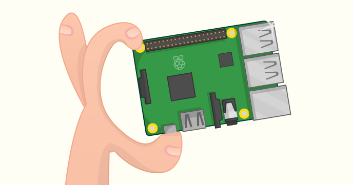

This is an archived resource. The repo will remain available but the resource will no longer be maintained or updated. Some or all parts of the resource may no longer work. To see our "Get started with Raspberry Pi" resources, please visit [raspberrypi.org/help](https://raspberrypi.org/help).

# Raspberry Pi Hardware Guide

Got a Raspberry Pi? Great! Let's get started by making sure you have all the cables and accessories you will need before plugging them all in and logging in for the first time.

By following this tutorial you will learn:

- What equipment you will need and how to set up your Raspberry Pi

## Licence

Unless otherwise specified, everything in this repository is covered by the following licence:

***Raspberry Pi Hardware Guide*** by the [Raspberry Pi Foundation](http://www.raspberrypi.org) is licenced under a [Creative Commons Attribution 4.0 International License](http://creativecommons.org/licenses/by-sa/4.0/).

Based on a work at https://github.com/raspberrypilearning/hardware-guide
