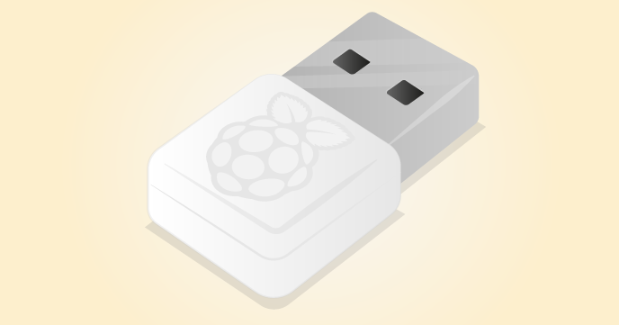

# Raspberry Pi Networking

You'll probably want to connect your Raspberry Pi to your local network or the Internet. Here you have a couple of options.

## Connecting via Ethernet

The Raspberry Pi has an Ethernet port, alongside the USB ports. If your Raspberry Pi is situated close to a router, access point or switch, you can connect to a network using an Ethernet cable.

Once you have plugged the Ethernet cable into the Raspberry Pi and the other end into an access point, your Raspberry Pi will automatically connect to the network

## Connecting via WiFi

If you have a Raspberry Pi 3, then there is built in WiFi. If you are using an earlier version of the Raspberry Pi, then you will need a USB WiFi dongle.

Some WiFi dongles, when used with the Raspberry Pi, are simple plug 'n' play devices. Others require specific drivers and may not be compatible with the Raspberry Pi. Make sure you read the device manufacturers documentation before making a purchase.

You can buy the official Raspberry Pi WiFi Dongle [here]() and [here]()
