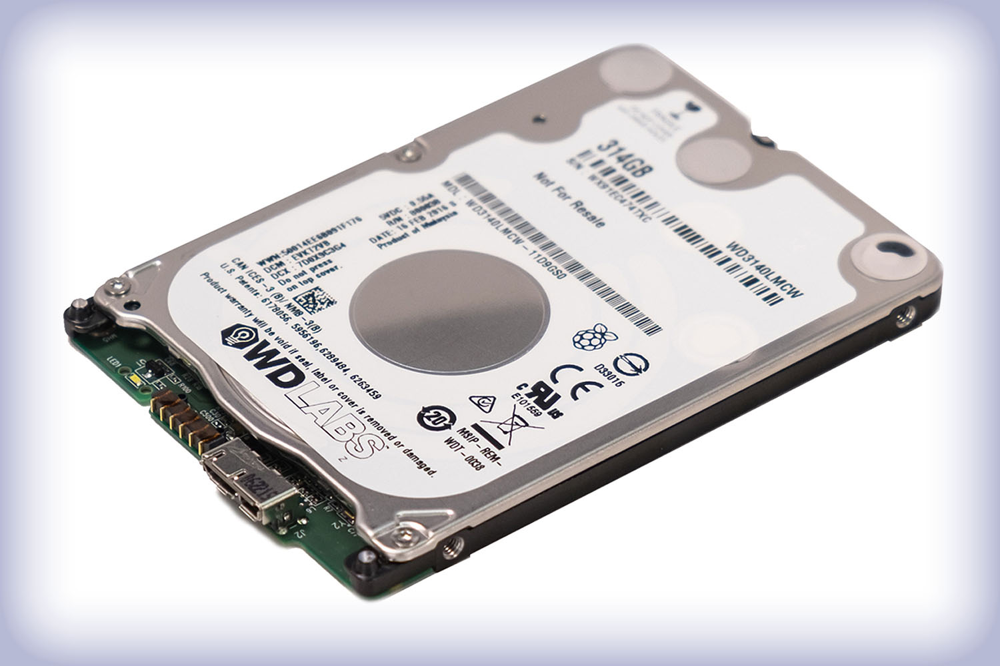

# Adding storage to your Raspberry Pi

You might find that the 8GB SD card you are using with your Raspberry Pi, just isn't large enough for your needs. There are several options for increasing the storage capacity of your Raspberry Pi.

## A bigger SD card

SD card come in a variety of sizes. The largest (reasonably priced) micro SD cards are 128GB, which should provide you with ample storage. As always, check the manufactureres documentation to ensure that the card is compatible with a Raspberry Pi.

## USB Flash Drives

There are lots of diffent types of storage device that you can plug directly into the USB ports of your Raspberry Pi, to act as secondary storage. USB Flash drives come in a variety of styles and sizes, up to about 1TB if you need that much.

## External Hard Drives
There are also external hard drives that you can purchase that can be connected via USB cable to transfer data. You have to be a little careful here. Some external hard drives are independently powered, and will work without problems. Some draw their power via the USB port, and might need more current that the Raspberry Pi can supply. Read the manufacturer's documentation to ensure any hard drive you are using will work with the Raspberry Pi. Some external hard drives have been designed to specifically work with the Raspberry Pi, such as the [PiDrive](http://wdlabs.wd.com/products/wd-pidrive-314gb/)

